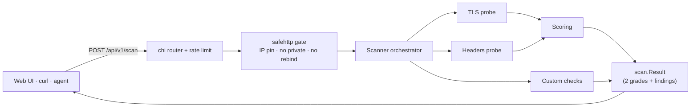

<p align="center">
  <a href="./LICENSE"></a>
  
  
  
</p>

<p align="center">
  <a href="https://github.com/JoshuaMart/WebSec0/actions/workflows/ci.yml"></a>
  <a href="https://github.com/JoshuaMart/WebSec0/actions/workflows/codeql.yml"></a>
  <a href="https://goreportcard.com/report/github.com/JoshuaMart/websec0"></a>
  <a href="https://api.securityscorecards.dev/projects/github.com/JoshuaMart/WebSec0"></a>
</p>

# WebSec0

> [!WARNING]
> Work In Progress

**WebSec0** is an open-source, self-hostable, **passive** web security
configuration scanner. In a single ~15 MB binary, it inspects a host's TLS
configuration and HTTP security headers, runs a handful of custom checks
(`security.txt`, `robots.txt`, …), and produces **actionable reports with
copy-paste remediation snippets**.

Built for **two audiences at parity**:

- Humans — clear reports prioritized by ROI (security ÷ effort)
- AI agents — every finding is self-sufficient (no external fetch needed),
  the catalog is exposed via `GET /api/v1/checks`, and a ready-to-use
  [`SKILL.md`](./skills/websec0/SKILL.md) is shipped

## Try it

**Hosted instance:** [www.websec0.com](https://www.websec0.com) — no signup,
no key, public.

Or call the API directly:

```bash
curl -sS -X POST https://www.websec0.com/api/v1/scan \
  -H 'Content-Type: application/json' \
  -d '{"host":"github.com"}' | jq .
```

The full request/response contract, error envelope and grading model are
documented in [`SKILL.md`](./skills/websec0/SKILL.md) — written for AI agents
but human-readable.

## Self-host

Run the distroless image locally:

```bash
docker build -t websec0 .
docker run --rm -p 8080:8080 websec0
```

Then open <http://localhost:8080>. The image weighs ~15 MB and runs as a
non-root user.

<details>
<summary><strong>From source</strong></summary>

Requires Go 1.26+, Node 22+, pnpm 10+, and rsync.

```bash
make frontend-install
make frontend
make build
./dist/websec0
```

`make frontend` builds the Astro bundle and rsyncs it into
`internal/frontend/dist/` where `//go:embed` picks it up at build time.

</details>

<details>
<summary><strong>Configuration</strong></summary>

WebSec0 runs with sensible defaults; no configuration file is required for
local use. To tune the listen address, rate limits, history retention or
the SSRF policy, copy [`websec0.yaml.example`](./websec0.yaml.example) next
to the binary as `websec0.yaml` — it is auto-discovered on startup. Use
`--config /path/to/file.yaml` to override the search path.

</details>

## How it works



Every outbound request goes through **`safehttp`**: each target is pinned
to a single IP at DNS-resolution time, RFC 1918 / loopback / link-local
addresses are always refused, and the connection is rate-limited per host.
Probes then fan out in parallel — a typical scan completes in ~10 seconds.

## Contributing

See [`CONTRIBUTING.md`](./CONTRIBUTING.md) for the dev workflow and the
three flavours of "adding a check". Security reports go through the
private channel documented in [`SECURITY.md`](./SECURITY.md).

AI agents integrating WebSec0 should start with
[`skills/websec0/SKILL.md`](./skills/websec0/SKILL.md).

## License

[MIT](./LICENSE) for the code. Reports generated by the public instance are
published under [Creative Commons BY 4.0](https://creativecommons.org/licenses/by/4.0/).
