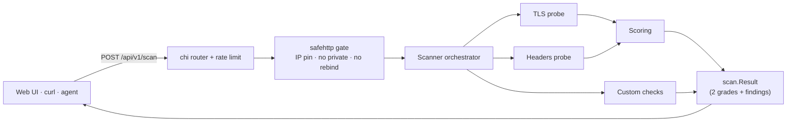

<p align="center">
  <a href="./LICENSE"></a>
  
  
  
</p>

<p align="center">
  <a href="https://github.com/JoshuaMart/WebSec0/actions/workflows/ci.yml"></a>
  <a href="https://github.com/JoshuaMart/WebSec0/actions/workflows/codeql.yml"></a>
  <a href="https://golangci-lint.run/"></a>
  <a href="https://api.securityscorecards.dev/projects/github.com/JoshuaMart/WebSec0"></a>
</p>

# WebSec0

**WebSec0** is an open-source, self-hostable, **passive** web security
configuration scanner. In a single ~15 MB binary, it inspects a host's TLS
configuration and HTTP security headers, runs a handful of custom checks
(`security.txt`, `robots.txt`, …), and produces **actionable reports with
copy-paste remediation snippets**.

Registrable domains and their `www` aliases also get **SPF/DMARC checks**,
with verdicts and recommendations independent of TLS/HTTP grades.

Built for **two audiences at parity**:

- Humans — clear reports prioritized by ROI (security ÷ effort)
- AI agents — every finding is self-sufficient (no external fetch needed),
  the catalog is exposed via `GET /api/v1/checks`, and a ready-to-use
  [`SKILL.md`](./skills/websec0/SKILL.md) is shipped

## Try it

**Hosted instance:** [www.websec0.com](https://www.websec0.com) — no signup,
no key, public.

Or call the API directly:

```bash
curl -sS -X POST https://www.websec0.com/api/v1/scan \
  -H 'Content-Type: application/json' \
  -d '{"host":"github.com"}' | jq .
```

See the [API contract](./skills/websec0/references/api.md) and
[report interpretation guide](./skills/websec0/references/interpretation.md)
for request/response fields, errors and grading.

## Self-host

Pull and run the published multi-arch image. Defaults work out of the box:

```bash
docker run --rm -p 8080:8080 ghcr.io/joshuamart/websec0:latest
```

Open <http://localhost:8080>. The distroless image weighs ~15 MB and runs as a
non-root user. To override the defaults (listen address, rate limits, SSRF
policy, history retention), mount a config file:

```bash
docker run --rm -p 8080:8080 \
  -v "$(pwd)/websec0.yaml":/etc/websec0/websec0.yaml:ro \
  ghcr.io/joshuamart/websec0:latest \
  --config /etc/websec0/websec0.yaml
```

Use [`websec0.yaml.example`](./websec0.yaml.example) as a starting point —
every field is annotated.

Certificate validation uses the operating system's trust store. If system trust
is unavailable, the binary uses an embedded Mozilla/NSS root bundle provided by
[`x509roots/fallback`](https://pkg.go.dev/golang.org/x/crypto/x509roots/fallback).
No roots are downloaded at runtime. A certificate rejected by an available
system store is not retried against the fallback. Trust decisions can still
differ between operating systems. Keep WebSec0 updated to refresh the bundle.

<details>
<summary><strong>Build the image yourself</strong></summary>

The repo ships two Dockerfiles. `Dockerfile` builds Go inside Docker and is
what `make docker` invokes; `Dockerfile.goreleaser` is the minimal copy-only
runtime used by the release pipeline.

```bash
docker build -t websec0 .
docker run --rm -p 8080:8080 websec0
```

</details>

<details>
<summary><strong>From source</strong></summary>

Requires Go 1.26+, Node 22.18+, pnpm 10+, and rsync.

```bash
make frontend-install
make build
./dist/websec0
```

`make build` declares the embedded Astro bundle as a Make prerequisite,
so it rebuilds the frontend (and rsyncs it into `internal/frontend/dist/`
where `//go:embed` picks it up) iff a file under `web/` has changed.
Iterative Go-only builds incur no frontend overhead.

</details>

## How it works


```mermaid
flowchart LR
    User[Web UI · curl · agent] -->|POST /api/v1/scan| API[chi router + rate limit]
    API --> SSRF[safehttp gate<br/>IP pin · no private · no rebind]
    SSRF --> Orch[Scanner orchestrator]
    Orch --> TLS[TLS probe]
    Orch --> HDR[Headers probe]
    Orch --> Custom[Custom checks]
    TLS --> Score[Scoring]
    HDR --> Score
    Score --> Result["scan.Result<br/>(2 grades + findings)"]
    Custom --> Result
    Result --> User
```

Every outbound request goes through **`safehttp`**: each target is pinned
to a single IP at DNS-resolution time, RFC 1918 / loopback / link-local
addresses are always refused, and the connection is rate-limited per host.
Probes then fan out in parallel — a typical scan completes in ~10 seconds.

## Contributing

See [`CONTRIBUTING.md`](./CONTRIBUTING.md) for the dev workflow and the
three flavours of "adding a check". Security reports go through the
private channel documented in [`SECURITY.md`](./SECURITY.md).

AI agents integrating WebSec0 should start with
[`skills/websec0/SKILL.md`](./skills/websec0/SKILL.md).

## License

[MIT](./LICENSE) for the code. Reports generated by the public instance are
published under [Creative Commons BY 4.0](https://creativecommons.org/licenses/by/4.0/).

### Frontend metadata

The static frontend uses `https://www.websec0.com` for its canonical URL,
sitemap, `llms.txt` and structured data. When building for another public instance, set
`PUBLIC_SITE_URL` to that instance's origin, for example:

```sh
PUBLIC_SITE_URL=https://scanner.example.org make -B frontend
make build
```

The homepage is indexable; report pages have `noindex` metadata and are excluded
from the sitemap. Public-history listing remains opt-in. Unlisted reports are
accessible to anyone with the report link while cached.

Agent discovery is served as static content: `/llms.txt` summarizes the project
and links to its documentation; `/.well-known/ai-catalog.json` advertises the
existing WebSec0 agent skill using the ARD 1.0 catalog format. Both are linked
from the HTML head and embedded in the Go binary by `make build`.
