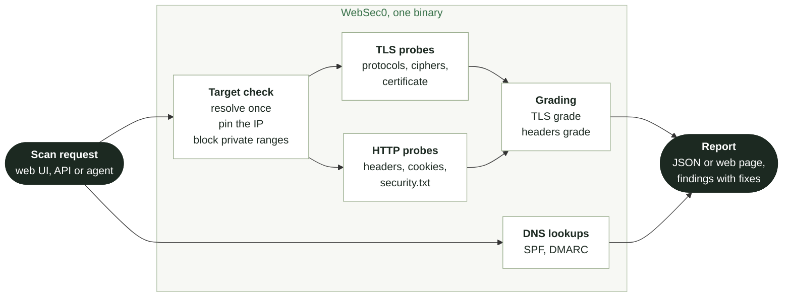

<p align="center">
  <a href="./LICENSE"></a>
  
  
  
</p>

<p align="center">
  <a href="https://github.com/JoshuaMart/WebSec0/actions/workflows/ci.yml"></a>
  <a href="https://github.com/JoshuaMart/WebSec0/actions/workflows/codeql.yml"></a>
  <a href="https://golangci-lint.run/"></a>
  <a href="https://api.securityscorecards.dev/projects/github.com/JoshuaMart/WebSec0"></a>
</p>

# WebSec0

WebSec0 checks a website's TLS setup and HTTP security headers, grades them,
and explains how to fix what it finds. It is passive: it reads what the server
offers and never tries to exploit it. It is open source and ships as a single
binary with its web interface built in.

**Try it at [www.websec0.com](https://www.websec0.com)**: free, no account.

## What it checks

| Area | Checks | Result |
| --- | --- | --- |
| TLS | Protocols (SSLv2 to TLS 1.3), cipher suites, certificate chain and expiry, OCSP stapling, known weaknesses | TLS grade |
| HTTP headers | HSTS, CSP, X-Frame-Options, X-Content-Type-Options, Referrer-Policy, Permissions-Policy, plus cookies, CORS and cross-origin policies | Headers grade |
| Other signals | `security.txt`, `robots.txt` | Informational |
| Email | SPF and DMARC records, for registrable domains and their `www` | Informational |

Every finding comes with an explanation and a remediation snippet. The full
list is served by the API at `GET /api/v1/checks`.

## Quick start

**Run your own instance** with the published multi-arch image:

```bash
docker run --rm -p 8080:8080 ghcr.io/joshuamart/websec0:latest
```

Then open <http://localhost:8080>.

**Use the API** of the hosted or your own instance:

```bash
curl -sS -X POST https://www.websec0.com/api/v1/scan \
  -H 'Content-Type: application/json' \
  -d '{"host":"github.com"}' | jq .
```

The [API contract](./skills/websec0/references/api.md) and the
[report guide](./skills/websec0/references/interpretation.md) describe the
fields, errors and grading.

## How it works


```mermaid
flowchart LR
    in(["<b>Scan request</b><br/>web UI, API or agent"])

    subgraph ws["WebSec0, one binary"]
        direction LR
        gate["<b>Target check</b><br/>resolve once<br/>pin the IP<br/>block private ranges"]
        tls["<b>TLS probes</b><br/>protocols, ciphers,<br/>certificate"]
        http["<b>HTTP probes</b><br/>headers, cookies,<br/>security.txt"]
        dns["<b>DNS lookups</b><br/>SPF, DMARC"]
        grade["<b>Grading</b><br/>TLS grade<br/>headers grade"]
        gate --> tls & http
        tls & http --> grade
    end

    out(["<b>Report</b><br/>JSON or web page,<br/>findings with fixes"])

    in --> gate
    in --> dns
    grade --> out
    dns --> out

    classDef step fill:#ffffff,stroke:#9aad8e,color:#1c2921
    classDef edge fill:#1c2921,stroke:#1c2921,color:#ffffff
    class gate,tls,http,dns,grade step
    class in,out edge
    style ws fill:#f7f8f4,stroke:#b5c4ac,color:#367047
```

1. **The target is checked first.** WebSec0 resolves the host once, refuses
   loopback, link-local and (by default) private addresses, and pins the IP
   for every TLS and HTTP connection, so a DNS change cannot redirect the scan.
   SPF and DMARC are plain DNS lookups.
2. **Probes run in parallel** within a 30-second budget. A typical scan takes
   about 10 seconds.
3. **The report** gives two independent grades, TLS and headers, and lists
   each finding with how to fix it. Reports stay available by link for 24
   hours by default and are only listed publicly if the user opts in.

## Configuration

The defaults work as is. To change them, mount a config file:

```bash
docker run --rm -p 8080:8080 \
  -v "$(pwd)/websec0.yaml":/etc/websec0/websec0.yaml:ro \
  ghcr.io/joshuamart/websec0:latest --config /etc/websec0/websec0.yaml
```

Start from [`websec0.yaml.example`](./websec0.yaml.example), where every field
is documented. The settings you are most likely to change:

| Setting | Default | Use it to |
| --- | --- | --- |
| `security.allow_private_targets` | `false` | Scan hosts on your private network |
| `security.allow_custom_ports` | `false` | Scan ports other than 443 |
| `history.rate_limit` | `10/hour` per IP | Adjust scan limits |
| `cache.ttl` | `24h` | Keep reports available longer |
| `frontend.head_inject` | empty | Add analytics or meta tags to every page |
| `frontend.csp_extra_sources` | empty | Allow external scripts loaded by `head_inject` |

Certificates are validated against the system trust store, with an embedded
Mozilla root bundle as a fallback when none is available. Nothing is
downloaded at runtime.

## Running a public instance

WebSec0 sends the security headers it grades on every response, including a
Content-Security-Policy without `'unsafe-inline'`. Leave HSTS to the reverse
proxy that terminates TLS.

If you add analytics through `head_inject`, allow its origin, or the browser
blocks it:

```yaml
frontend:
  head_inject: |
    <script defer src="https://umami.example.com/script.js" data-website-id="…"></script>
  csp_extra_sources: ["https://umami.example.com"]
```

<details>
<summary><strong>Canonical URL, guides and sitemap</strong></summary>

- **Your own domain.** The frontend uses `https://www.websec0.com` for its
  canonical URL, sitemap, `llms.txt` and structured data. Rebuild it with
  `PUBLIC_SITE_URL=https://scanner.example.org make -B frontend && make build`.
- **Remediation guides.** Add
  `<meta name="websec0-guides-url" content="https://example.org/guides">` to
  `head_inject`. Failing headers in a report then link to
  `<guides-url>/<header-name>`.
- **Extra sitemap.** Set `PUBLIC_CONTENT_SITEMAP_URL` at build time to add a
  second `Sitemap:` line to `robots.txt`, or serve your own `robots.txt`
  through `static_overlay_dir`.
- **Indexing.** The homepage is indexable. Report pages are `noindex` and left
  out of the sitemap.

</details>

<details>
<summary><strong>Build from source</strong></summary>

Requires Go 1.26+, Node 22.18+, pnpm 10+ and rsync.

```bash
make frontend-install
make build
./dist/websec0
```

`make build` rebuilds and embeds the frontend only when a file under `web/`
has changed. To build the Docker image locally, run `docker build -t websec0 .`
(`Dockerfile.goreleaser` is the copy-only image used for releases).

</details>

## For AI agents

- [`skills/websec0/SKILL.md`](./skills/websec0/SKILL.md): a ready-to-use agent
  skill covering scope, instance choice and report interpretation.
- `GET /api/v1/checks`: the catalog of checks and remediations.
- `/llms.txt` and `/.well-known/ai-catalog.json`: discovery files served by
  every instance.

Each finding in a report is self-contained, so an agent does not need to fetch
anything else to explain it.

## Contributing

See [`CONTRIBUTING.md`](./CONTRIBUTING.md) for the development workflow and how
to add a check. Report vulnerabilities privately as described in
[`SECURITY.md`](./SECURITY.md).

## License

Code under the [MIT license](./LICENSE). Reports from the public instance are
published under [CC BY 4.0](https://creativecommons.org/licenses/by/4.0/).
